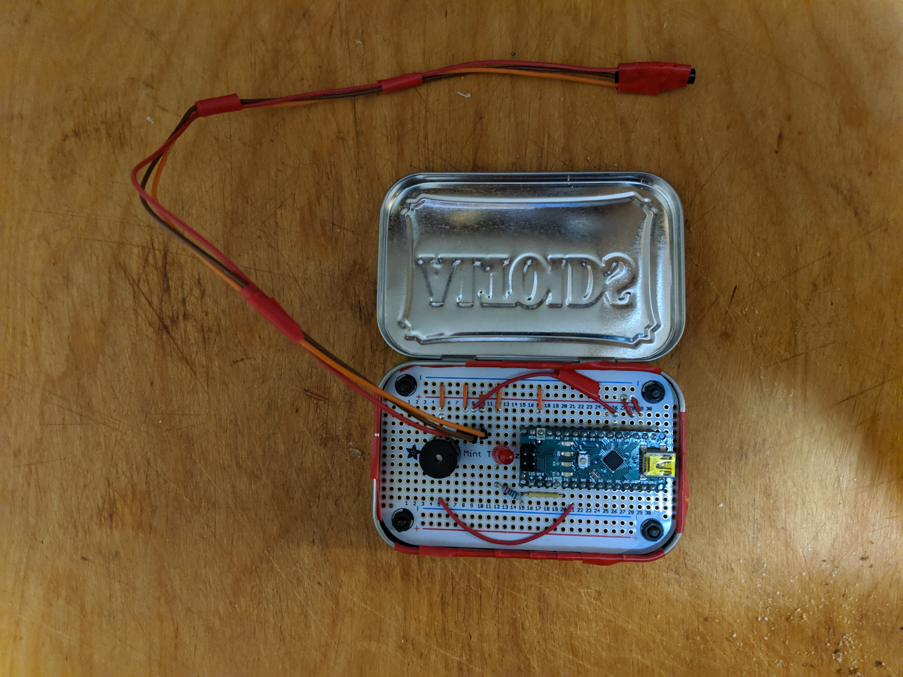

# Fridge Temperature Sensor with Arduino

---
A sensor to alart you to when the temperature inside a refrigerator or freezer has risen above a certain level.  It is currently configured to turn on the alarm at 0 °C.

## FAQs

**What is that perf board?**

It is the [Adafruit Perma-Proto Mint Tin Size Breadboard PCB](https://www.adafruit.com/product/723).

**Why did you do/use \<THING\> when \<OTHER THING\> would have been so much better?**

This is my first real project with designing circuits and working with the Arduino, so there are doubtless better ways of doing it.  I am more than open to pull requests with improvements.

**Why didn't you use a board that has networking so that you could send out an alert via \<SERVICE\>, rather than just using a buzzer and light?**

The building that I will be using this in is basically a Faraday cage, so there is no reason for me to do so.

**Has anyone _actually_ asked any of these question?**

No, but the question and answer format makes it easy to explain things.

**How many times did you seriously burn yourself while soldering?**

Once.
